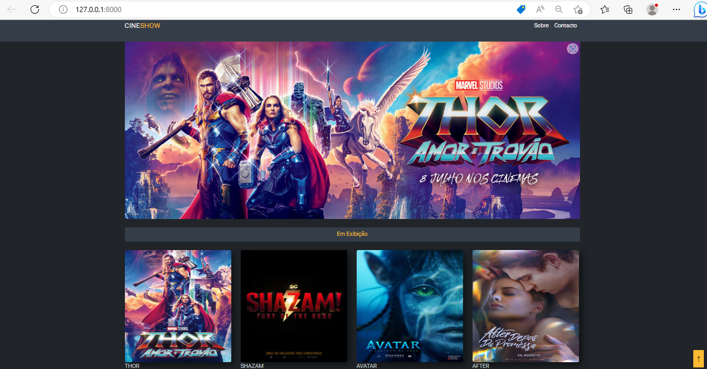
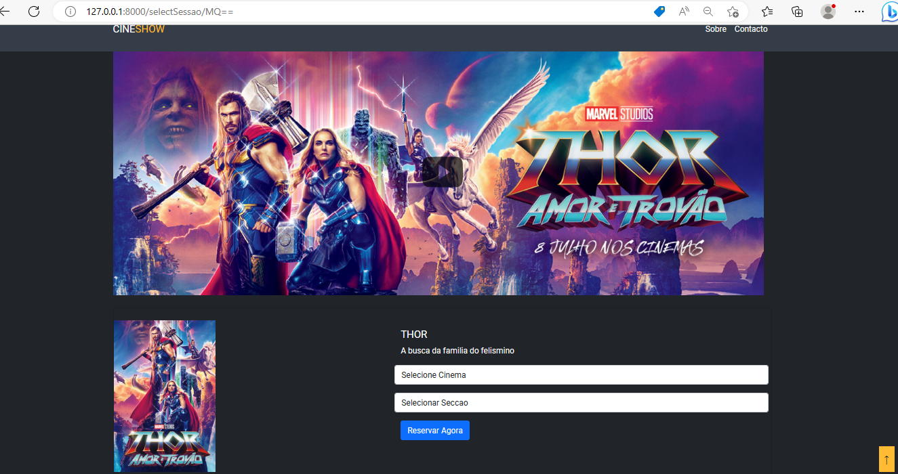
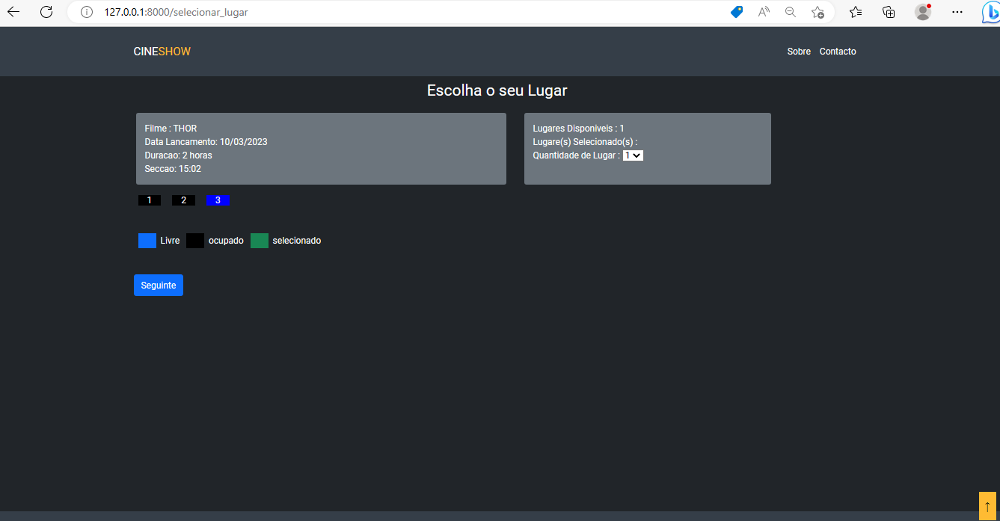
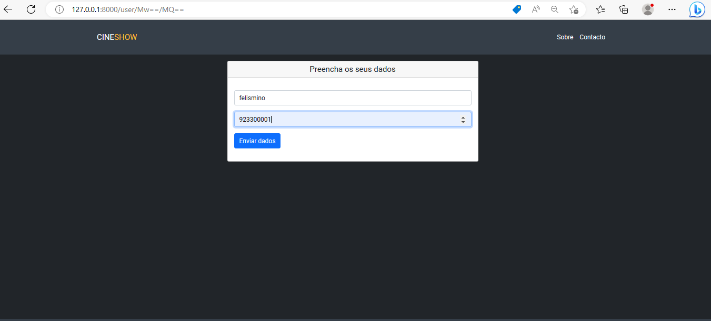
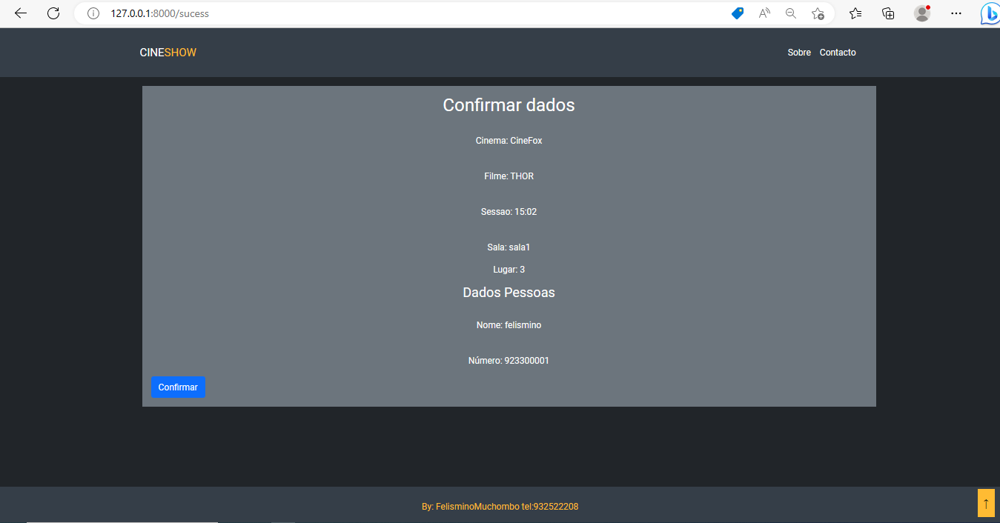

# CINESHOW Laravel

CINESHOW consiste em reservar um bilhete em um determinado cinema.

## Layout do Projecto








# Framework
Laravel

# Como executar o projeto

```bash
# clonar repositório
https://github.com/Felismino2022/projectoCinemaComLaravel82022.git

# entrar na pasta do projeto 
cd projecto

# executar o projeto
php artisan serven
```


# Autor

Felismino Muchombo


